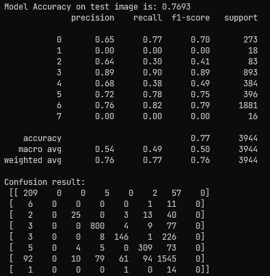

# Fer2013Plus Human Faical Emtion Detection

## Introduction:

This is a tensorflow v2 implementation of original Microsoft Face Emotion Detection which is based on CNTK. By working on this project, I also studied on some basic tensorflow, machine learning, and deep learning knowledge. Now this project is fully functional from end to end with some basic evaluation tools included as well. I will list all citation and references at the end of this README.

## Environment and Dependencies:

I worked on conda python 3.9 virtual environment. Some key dependencies are listed here:

- tensorflow
- numpy
- matplotlib
- pandas
- scikit-learn & scikit-image

## Workflow

1. Prepare the dataset: I have included two base csv files here in this repo. I choose to prepare the fer2013plus dataset in the same way as fer2013 does, instead of in the original Microsoft approach;
2. Check the model and start the training process: `model.py` is the the same as the original Microsoft design based their original paper and code. I have tried my best to replicate the `train.py` as well, however, it is still not identicial. Current version can provide a final performance of 83% on validation set and 64% on test set;
3. Basic visualization and evaluation

## TO-DO:

1. Refine the training script
2. Study more on TF2 details
3. Study more on evaluating a model performance

## Citation:

1. [Microsoft CNTK FER+](https://github.com/microsoft/FERPlus): the FER+ new label annotations for the Emotion FER dataset.
2. [Facial Expression Recognition](https://github.com/luanshiyinyang/FacialExpressionRecognition): A Tensorflow2.0 & Keras implementation on Fer2013, Jaffe and CK+ datasets.